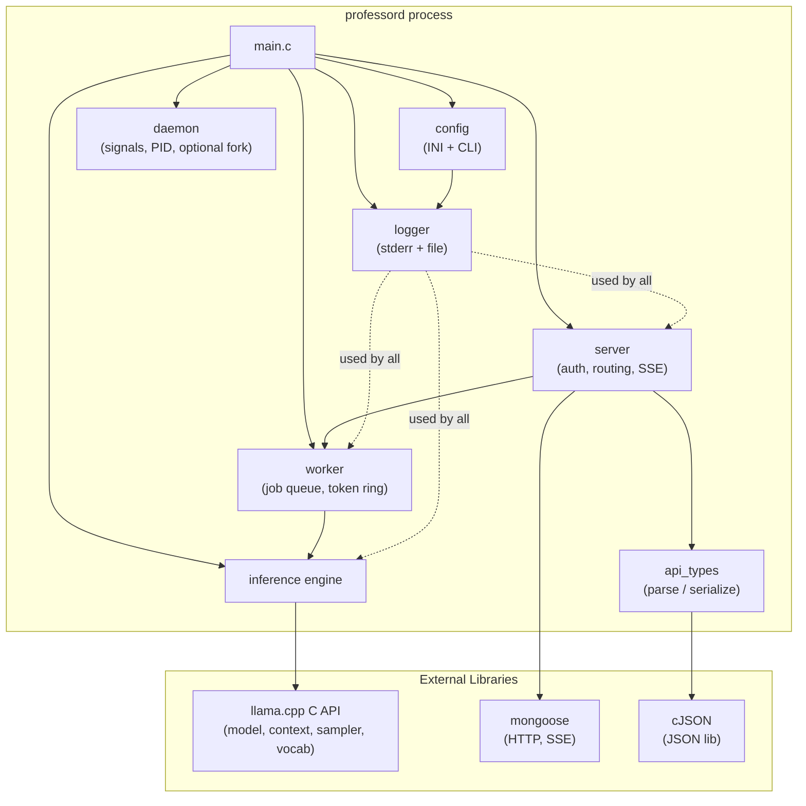
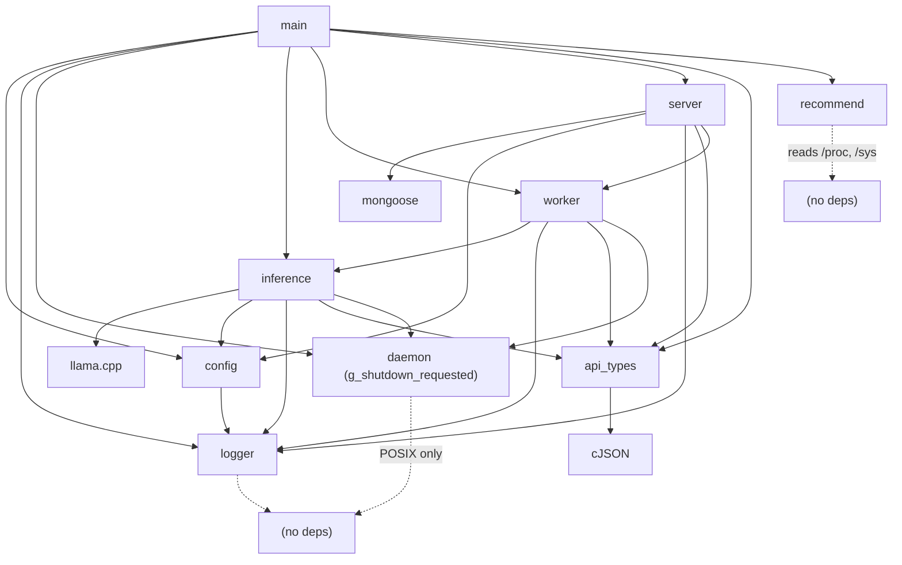
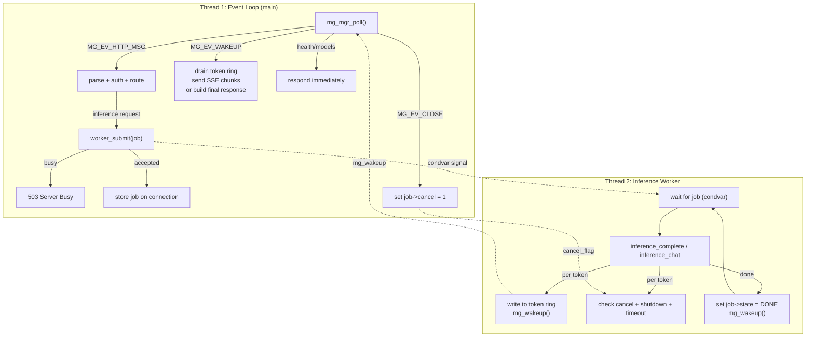
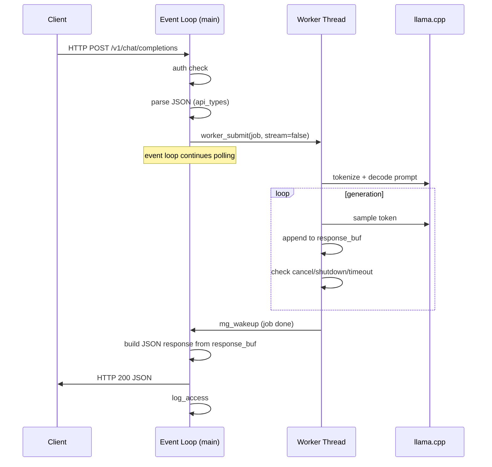
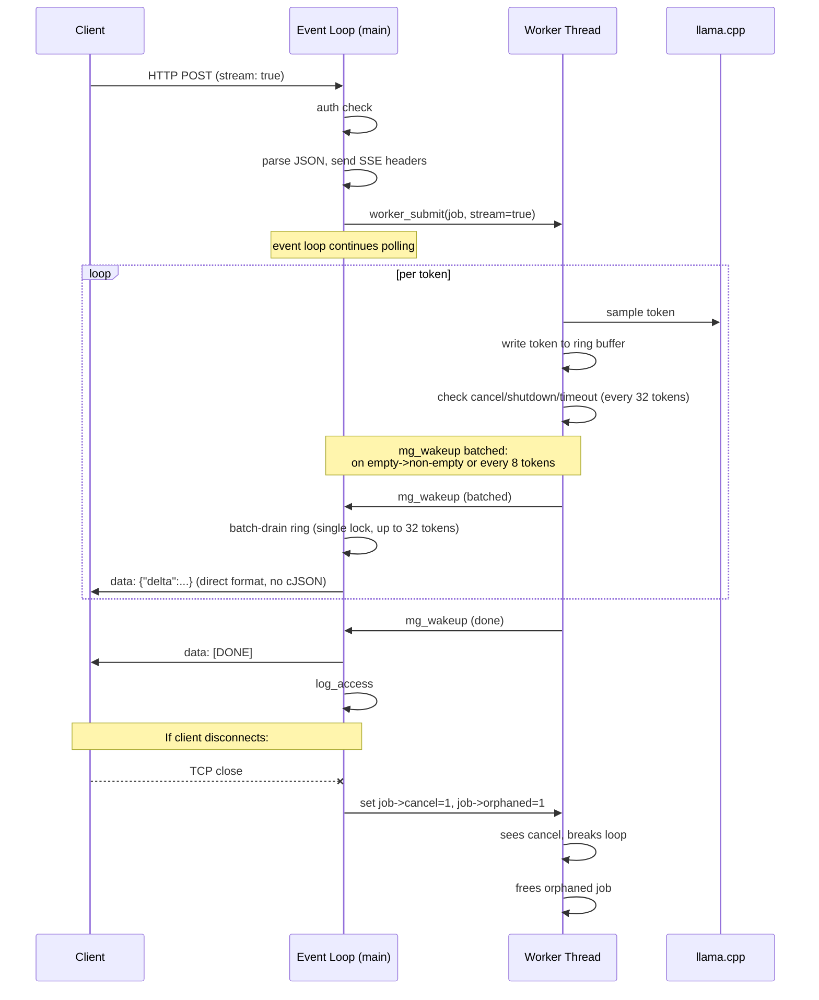
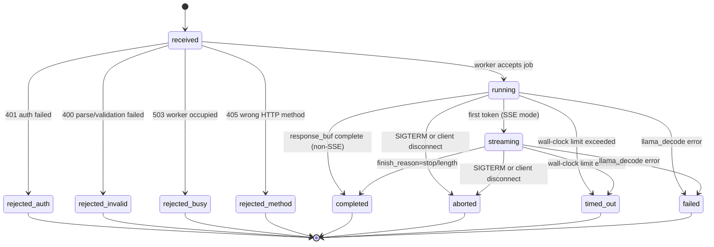
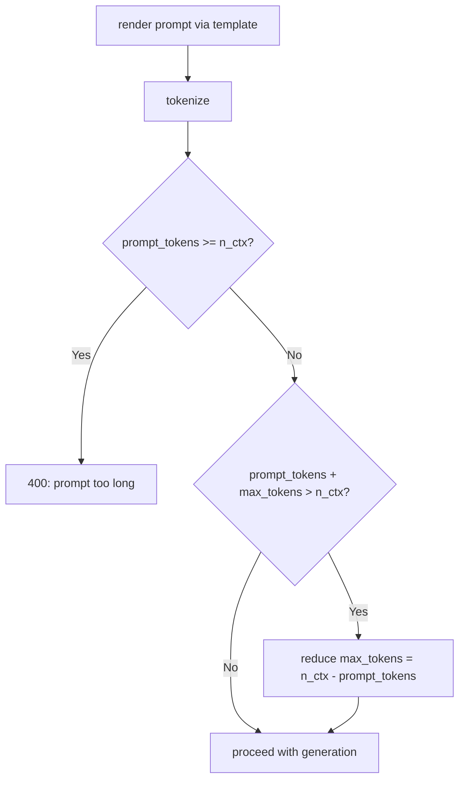
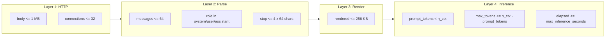
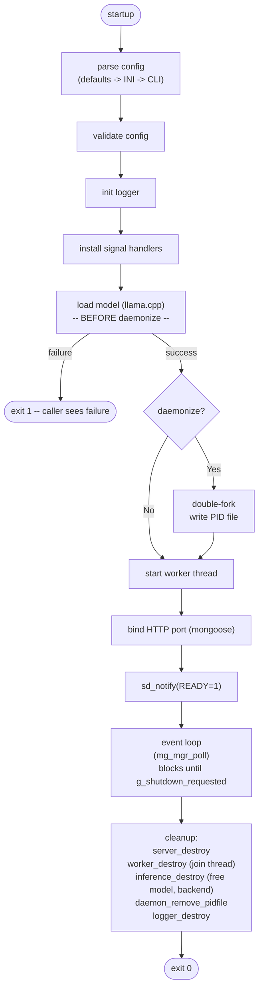
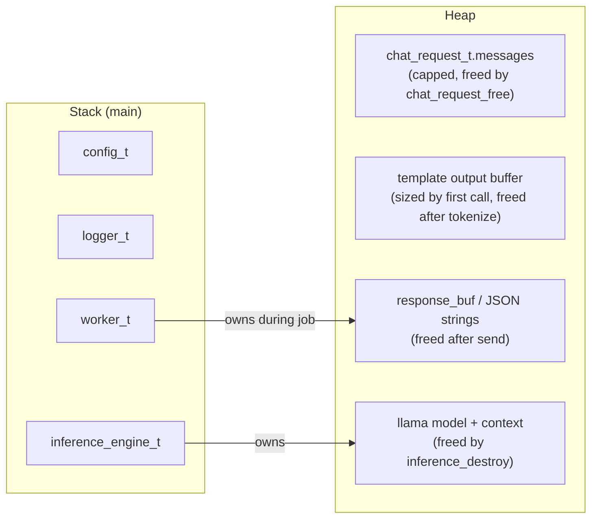

# Professor_AI Architecture (v3)

Updated: 2026-03-16
Incorporates security audit findings, performance optimizations, and operational improvements.

## Overview

Professor_AI is a Unix daemon (`professord`) that wraps llama.cpp to serve a local LLM via an OpenAI-compatible REST API. Written in pure C (C11), targets AMD GPUs via ROCm, serves a single primary client (Hermes on Jetson Orin Nano) over LAN.

## Component Diagram



## Module Dependency Graph



No circular dependencies. Build order follows dependency graph bottom-up.

## Threading Model



**Two-thread design**: The main thread runs the mongoose event loop handling all network I/O, parsing, authentication, SSE writes, and health checks. The worker thread runs exactly one inference job at a time. Communication uses a token ring buffer (protected by mutex + condvar) and `mg_wakeup()` to notify the event loop. `job->state` is `atomic_int` for safe cross-thread reads without requiring the mutex.

**Why two threads**: Even though only one GPU context exists (concurrent inference is impossible), decoupling inference from the event loop provides:

1. **Responsive health checks** -- never blocked by inference
2. **Disconnect detection** -- main thread sees `MG_EV_CLOSE` immediately, sets cancel flag
3. **Clean shutdown** -- SIGTERM is checked per-token, not after generation completes
4. **Backpressure** -- slow clients cause the ring buffer to fill; worker blocks briefly then checks cancellation, preventing unbounded memory growth

**Concurrency policy**: Exactly one inference at a time. No queue. Second request while worker is busy returns 503 immediately.

## Data Flow

### Non-Streaming Request



### Streaming Request (SSE)



## Request State Machine



**Per-token checks in generation loop** (priority order):
1. `g_shutdown_requested` -> finish_reason = `"abort"`
2. `cancel_flag` (disconnect) -> finish_reason = `"abort"`
3. elapsed > `max_inference_seconds` -> finish_reason = `"time_limit"` (checked every 32 tokens)
4. `llama_decode` return != 0 -> finish_reason = `"backend_error"`
5. token == EOS -> finish_reason = `"stop"`
6. stop sequence suffix match (rolling window with pre-computed lengths) -> finish_reason = `"stop"`
7. `n_generated >= max_tokens` -> finish_reason = `"length"`

## API Contract

Base URL: `http://<host>:8080`

Default bind: `127.0.0.1:8080` (loopback). Must explicitly configure `listen_addr` for LAN access.

### Authentication

If `api_key` is set in config, all endpoints except `/health` and `/v1/health` require:

```
Authorization: Bearer <api_key>
```

Missing or invalid key returns 401. Empty `api_key` in config disables authentication.

### Endpoints

#### `GET /health` or `GET /v1/health`

Health check. No auth required.

**Response**:
```json
{"status": "ok"}
```

#### `GET /v1/models`

List available models.

**Response**:
```json
{
  "object": "list",
  "data": [
    {
      "id": "<model_alias>",
      "object": "model",
      "created": 0,
      "owned_by": "local"
    }
  ]
}
```

#### `POST /v1/chat/completions`

Chat completion (OpenAI-compatible).

**Request**:
```json
{
  "model": "local-model",
  "messages": [
    {"role": "system", "content": "You are a helpful assistant."},
    {"role": "user", "content": "Hello"}
  ],
  "temperature": 0.7,
  "top_p": 0.9,
  "max_tokens": 512,
  "stream": false,
  "stop": ["\n\n"]
}
```

All fields except `messages` are optional. `model` is accepted but ignored (single model).

**Constraints**:
- `messages`: max `PROF_MAX_MESSAGES` (64). Roles must be `system`, `user`, or `assistant`.
- `max_tokens`: capped to `n_ctx - prompt_tokens` at runtime.
- `stop`: max 4 sequences, 64 chars each.

**Response** (non-streaming):
```json
{
  "id": "chatcmpl-abc123",
  "object": "chat.completion",
  "created": 1710000000,
  "model": "local-model",
  "choices": [
    {
      "index": 0,
      "message": {
        "role": "assistant",
        "content": "Hello! How can I help you?"
      },
      "finish_reason": "stop"
    }
  ],
  "usage": {
    "prompt_tokens": 12,
    "completion_tokens": 8,
    "total_tokens": 20
  }
}
```

**Response** (streaming, `stream: true`):
```
data: {"id":"chatcmpl-abc123","object":"chat.completion.chunk","created":1710000000,"model":"local-model","choices":[{"index":0,"delta":{"role":"assistant","content":"Hello"},"finish_reason":null}]}

data: {"id":"chatcmpl-abc123","object":"chat.completion.chunk","created":1710000000,"model":"local-model","choices":[{"index":0,"delta":{"content":"!"},"finish_reason":null}]}

data: {"id":"chatcmpl-abc123","object":"chat.completion.chunk","created":1710000000,"model":"local-model","choices":[{"index":0,"delta":{},"finish_reason":"stop"}]}

data: [DONE]
```

#### `POST /v1/completions`

Text completion (OpenAI-compatible).

**Request**:
```json
{
  "model": "local-model",
  "prompt": "Once upon a time",
  "temperature": 0.7,
  "max_tokens": 256,
  "stream": false
}
```

**Response** (non-streaming):
```json
{
  "id": "cmpl-abc123",
  "object": "text_completion",
  "created": 1710000000,
  "model": "local-model",
  "choices": [
    {
      "index": 0,
      "text": " there was a brave knight...",
      "finish_reason": "length"
    }
  ],
  "usage": {
    "prompt_tokens": 5,
    "completion_tokens": 256,
    "total_tokens": 261
  }
}
```

### Error Responses

All errors return OpenAI-format JSON:

```json
{
  "error": {
    "message": "Invalid JSON in request body",
    "type": "invalid_json",
    "code": 400
  }
}
```

| HTTP | `type` | Condition |
|------|--------|-----------|
| 400 | `invalid_json` | Malformed JSON body |
| 400 | `invalid_request` | Missing fields, bad values, too many messages, unknown role, prompt too long |
| 401 | `unauthorized` | Bad/missing API key |
| 405 | `method_not_allowed` | Wrong HTTP method for endpoint |
| 404 | `not_found` | Unknown endpoint |
| 503 | `server_busy` | Worker thread occupied, try again |
| 500 | `backend_error` | llama_decode failure, internal error |

### Sampling Parameters

| Parameter | Type | Default | Clamp Range | Notes |
|-----------|------|---------|-------------|-------|
| `temperature` | float | 0.7 | [0.0, 2.0] | 0 = greedy decoding |
| `top_p` | float | 0.9 | (0.0, 1.0] | Nucleus sampling |
| `top_k` | int | 40 | [1, vocab] | Top-k sampling |
| `max_tokens` | int | 512 | [1, n_ctx-prompt] | Capped at runtime |
| `repeat_penalty` | float | 1.1 | [1.0, 2.0] | llama.cpp native |
| `frequency_penalty` | float | 0.0 | [0.0, 2.0] | OpenAI-compatible |
| `presence_penalty` | float | 0.0 | [0.0, 2.0] | OpenAI-compatible |
| `stop` | string[] | [] | max 4, 64 chars | Stop sequences |

Per-request parameters override config defaults. Omitted parameters (sentinel `NAN` / `-1`) fall back to config values. NaN and infinity in float fields are replaced with config defaults.

## Prompt Construction Contract

### Role Validation

- Accepted roles: `system`, `user`, `assistant`
- Unknown roles: rejected at parse time (400 `invalid_request`)
- Empty `content`: allowed (enables assistant prefill for guided generation)

### Template Application

1. Extract chat template from GGUF metadata via `llama_model_chat_template(model, NULL)`
2. If NULL, fall back to ChatML:
   ```
   <|im_start|>system\n{content}<|im_end|>\n
   <|im_start|>user\n{content}<|im_end|>\n
   <|im_start|>assistant\n
   ```
3. Apply template via `llama_chat_apply_template()` with `add_assistant=true`
4. Heap-allocate output buffer based on sizing call

### Tokenization

- `add_special=false`: the chat template already includes BOS/EOS/special tokens
- `parse_special=true`: the tokenizer must recognize special tokens embedded by the template

### Context Budget



- If the rendered prompt alone exceeds `n_ctx`: return 400 with explicit error message including token counts.
- If `prompt_tokens + max_tokens > n_ctx`: silently reduce `max_tokens` to fit. The response `usage` field shows actual counts.
- Prompt content is never silently truncated. The client is responsible for managing conversation length.

## Resource Budgets



Each layer rejects early. Expensive operations (template rendering, tokenization, inference) only run after cheaper checks pass.

## Configuration

Two sources, later overrides earlier:

1. **INI file** (`--config /path/to/file.ini`)
2. **CLI arguments** (`--model`, `--n-ctx`, `--api-key`, etc.)

CLI `--config` is extracted with a targeted scan, then the INI file is loaded, then CLI is parsed once to override INI values. This avoids double-parsing which caused accumulating options (like `--allow-ip`) to duplicate.

Default bind address is `127.0.0.1:8080` (loopback). LAN binding requires explicit `listen_addr = 0.0.0.0:8080` in config.

See `etc/professord.ini.example` for all options.

## Process Lifecycle



## Memory Management Strategy

- **Stack-allocated structs**: `config_t`, `logger_t`, `inference_engine_t`, `worker_t` are all owned by `main()` on the stack.
- **Fixed-size buffers**: Most strings use `char[N]` to avoid per-field malloc/free. All copies use `snprintf`, never `strncpy`.
- **Minimal heap usage**:
  - `chat_request_t.messages` -- heap array (capped at `PROF_MAX_MESSAGES`), freed by `chat_request_free()`
  - `*_to_json()` return heap strings -- caller frees with `free()`
  - `llama_chat_apply_template` output -- heap buffer sized by first call, freed after tokenization
  - Non-streaming response buffer -- heap with realloc-double, freed after send
  - llama.cpp model/context -- allocated by llama.cpp, freed by `inference_destroy()`
- **No heap in hot path**: Logger uses stack buffers. Token ring buffer is pre-allocated in `worker_job_t`. SSE streaming uses direct `mg_printf` formatting instead of cJSON allocation per token.



## Build System

CMake with FetchContent for dependencies. See `doc/PLAN.md` for full CMakeLists.txt and build commands.

```bash
# Standard build
cmake -B build -DGGML_HIP=ON -DCMAKE_BUILD_TYPE=Release
cmake --build build -j$(nproc)

# With systemd readiness
cmake -B build -DGGML_HIP=ON -DPROF_USE_SYSTEMD=ON -DCMAKE_BUILD_TYPE=Release

# Run
./build/professord --model /path/to/model.gguf

# Run on LAN
./build/professord --model /path/to/model.gguf --listen-addr 0.0.0.0:8080 --api-key mysecretkey
```

## Security Measures

- **Constant-time auth**: API key comparison always runs full expected-length loop to prevent timing side-channel attacks on key length.
- **IP ACL normalization**: IPv4-mapped IPv6 addresses (`::ffff:127.0.0.1`) are normalized before ACL comparison to prevent bypass.
- **PID file safety**: Stale PID files are validated (checks if old PID is still running) before overwriting. Uses `O_EXCL` to prevent symlink attacks.
- **Atomic job state**: `job->state` uses `atomic_int` to prevent data races between worker and event loop threads.
- **Orphaned job cleanup**: When a client disconnects during inference, the job is marked `orphaned` and freed by the worker thread after inference completes, preventing memory leaks.
- **Bounds checking**: Log level validated before array indexing. cJSON creation checked for NULL on all serialization paths. Sampler chain checked for NULL after allocation.
- **Daemon hardening**: Daemonize fails if `/dev/null` cannot be opened instead of silently continuing with inherited file descriptors.
- **Log routing**: llama.cpp and mongoose output routed through the logger to respect `--log-level` and prevent information leakage at high log levels.

## Performance Architecture

Token generation throughput is memory-bandwidth bound. The `--recommend` flag reports estimated tok/s per model based on detected hardware bandwidth.

**llama.cpp configuration**:
- `n_threads` auto-detects to `nproc/2` for optimal CPU utilization during prompt processing
- `n_batch` defaults to 2048 (matching llama.cpp default) for efficient prompt eval
- KV cache uses q8_0 quantization to halve attention memory bandwidth vs f16
- Flash attention enabled (auto mode)
- Performance counters logged per request (prompt tok/s, eval tok/s)

**Streaming hot path** (zero heap allocation per token):
- Ring buffer uses `memcpy` instead of `snprintf` for token copies
- `mg_wakeup()` batched to reduce syscalls (empty-to-non-empty transition or every 8 tokens)
- Ring drain acquires lock once for up to 32 tokens instead of per-token
- SSE chunks formatted directly via `mg_printf` with `MG_ESC` (no cJSON tree build/serialize/free per token)
- Timeout checked every 32 tokens instead of every token
- Stop sequence lengths pre-computed once before generation loop

## Testing

Test suite: `tests/test_all.sh` runs 43 tests across 5 categories and generates timestamped reports in `tests/reports/`.

| Category | Tests | Coverage |
|----------|-------|----------|
| Unit tests | 2 | config parsing, API types |
| Functional | 7 | health, models, routing, auth, error codes |
| Inference | 4 | chat, completion, streaming, admission control |
| Stress | 21 | malformed input, numeric edges, method abuse, large payloads, rapid-fire, concurrency, auth edges |
| Stability | 2 | server alive, final inference after stress |
